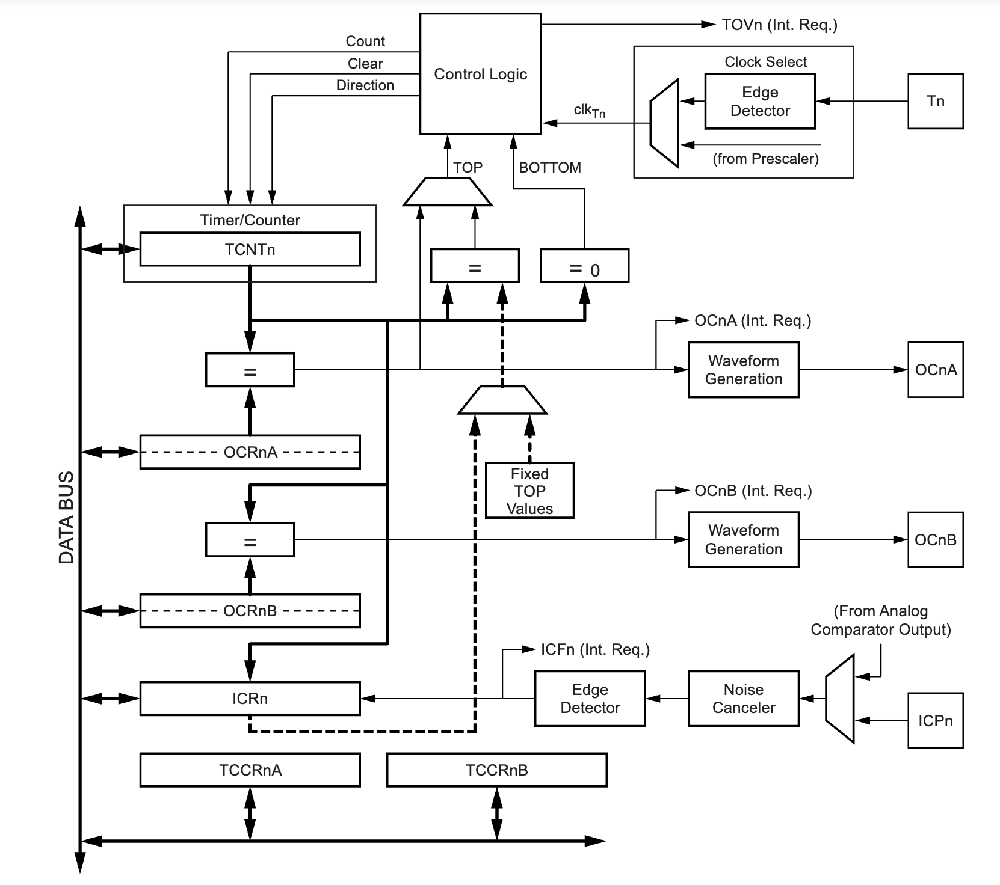

# 16 bit PWM Modulator with Real-Time Resolution and Dual Mode Duty Cycle Adjustment

# Schematics

{fig-align="center" width="432" height="323"}

{fig-align="center" width="460"}

## Microcontroller Connections

The microcontroller (e.g., ATmega328P) is the core component responsible for generating PWM signals. Here’s how it connects to other components:

-   **PWM Output Pin:** Pin 9 (OC1A) is used for the PWM output. This pin will be connected to the load or device to control with PWM.

    -   **Connection:**
        -   **Pin 9 (OC1A)** of the ATmega328P connects to the positive terminal of the PWM-controlled device.
        -   The negative terminal of the device is connected to the ground (GND).

-   **Analog Input Pin:** Pin A0 is used to read the potentiometer value.

    -   **Connection:**
        -   **Pin A0** of the ATmega328P connects to the middle wiper of the potentiometer.
        -   The two outer pins of the potentiometer connect to **VCC (5V)** and **GND** respectively.

## Potentiometer

The potentiometer is used to vary the PWM duty cycle in potentiometer mode.

-   **Wiper Pin (Middle Pin):** Connects to **Pin A0** of the microcontroller.
-   **One Outer Pin:** Connects to **VCC (5V)**.
-   **Other Outer Pin:** Connects to **GND**.

## Serial Interface

The serial interface is used for mode switching and command input.

-   **TX Pin (Transmit) of the Microcontroller:** Connects to the RX pin of the USB-to-Serial adapter or computer.
-   **RX Pin (Receive) of the Microcontroller:** Connects to the TX pin of the USB-to-Serial adapter or computer.
-   **GND:** Connects to the ground of the USB-to-Serial adapter or computer.

## Power Supply

-   **VCC (5V):** Provides power to the microcontroller and other components. This can be supplied via the USB connection or an external 5V power source.
-   **GND:** Provides the common ground for the microcontroller, potentiometer, and other connected components.

# Working Principles in Detail

## Working Principle:

### Mode Selection and Operation

The project operates in two distinct modes:

-   **Potentiometer Mode**: Uses an analog potentiometer to adjust the PWM duty cycle directly.
-   **Serial Monitor Mode**: Uses commands entered in the Serial Monitor to adjust PWM settings, including resolution and duty cycle.

### Initialization

Upon startup:

-   **`setup()` Function**:
    -   Initializes the Serial Monitor to communicate with the user.
    -   Prints instructions for operation.
    -   Configures PWM settings with default values.

### PWM Configuration

PWM (Pulse Width Modulation) involves generating a signal that switches between HIGH and LOW states. The duty cycle of this signal determines the proportion of time the signal is HIGH in one cycle, effectively controlling power delivered to a load.

-   **PWM Resolution**: Determines the granularity of the PWM signal. For instance, a 16-bit resolution provides 65,536 levels of granularity, allowing for very fine control of the duty cycle.
-   **PWM Duty Cycle**: Represents the percentage of time the signal is HIGH within one cycle. For example, a 50% duty cycle means the signal is HIGH for half of the cycle duration.

The PWM signal is generated using Timer1 on the Arduino:

-   **`configurePWM()` Function**:
    -   Sets up Timer1 for Fast PWM mode with a given resolution.
    -   Configures output pins (PB1 and PB2) for PWM.
    -   Sets the TOP value in the `ICR1` register, which defines the maximum count value for the PWM period.

### Mode Operation

-   **Potentiometer Mode**:
    -   Reads the analog value from a potentiometer.
    -   Maps this value to a corresponding duty cycle percentage.
    -   Updates the PWM signal based on the mapped duty cycle.
    -   Switching to Serial Monitor Mode occurs if the potentiometer voltage is close to the maximum (e.g., 5V).
-   **Serial Monitor Mode**:
    -   Commands are entered via the Serial Monitor to adjust PWM settings.
    -   Commands can change the resolution (`a` to `i`) or adjust the duty cycle (0 to 100%).
    -   The `processSerialInput()` function reads and processes these commands, updating the PWM configuration as necessary.

### Detailed Operation

1.  **Potentiometer Reading and Duty Cycle Update:**
    -   **`readPotentiometer()` Function**:
        -   Reads the analog value from the potentiometer.
        -   Converts this value to a duty cycle percentage.
        -   Updates the PWM duty cycle if it has changed.
2.  **Serial Input Processing:**
    -   **`processSerialInput()` Function**:
        -   Reads commands from the Serial Monitor.
        -   Differentiates between duty cycle commands and resolution change commands.
        -   Updates the PWM configuration based on the received commands.
        -   Validates commands to ensure they are within acceptable ranges.
3.  **PWM Value Update:**
    -   **`updatePWMValue()` Function**:
        -   Calculates the appropriate PWM value based on the duty cycle and resolution.
        -   Writes this value to the PWM output register to adjust the duty cycle.
4.  **PWM Output Control:**
    -   **`analogWritePin9()` Function**:
        -   Controls the PWM output on pin 9 (OC1A) based on the calculated duty cycle value.
        -   Ensures the PWM signal is correctly generated or disabled if the duty cycle is zero.

### Resolution Calculation

The resolution determines the maximum count value (`ICR1`) for the PWM period:

-   **`calculateICR(int resolution)` Function**:
    -   Maps the desired resolution to a specific maximum value.
    -   For example, 16-bit resolution uses `0xFFFF`, which corresponds to a maximum count of 65,535.

## 16 bit Timer/Counter1 with PWM

The Timer/Counter (TCNT1), output compare registers (OCR1A/B), and input capture register (ICR1) are all 16-bit registers. Special procedures must be followed when accessing the 16-bit registers.

The Timer/Counter control registers (TCCR1A/B) are 8-bit registers and have no CPU access restrictions.

The double buffered output compare registers (OCR1A/B) are compared with the Timer/Counter value at all time. The result of the compare can be used by the waveform generator to generate a PWM or variable frequency output on the output compare pin (OC1A/B). The compare match event will also set the compare match flag (OCF1A/B) which can be used to generate an output compare interrupt request.

The TOP value, or maximum Timer/Counter value, can in some modes of operation be defined by either the OCR1A register, the ICR1 register, or by a set of fixed values. When using OCR1A as TOP value in a PWM mode, the OCR1A register can not be used for generating a PWM output. However, the TOP value will in this case be double buffered allowing the TOP value to be changed in run time. If a fixed TOP value is required, the ICR1 register can be used as an alternative, freeing the OCR1A to be used as PWM output.

{fig-align="center"}


A 16-bit comparator continuously compares TCNT1 with the output compare register (OCR1x). If TCNT equals OCR1x the comparator signals a match. A match will set the output compare flag (OCF1x) at the next timer clock cycle. If enabled (OCIE1x = 1), the output compare flag generates an output compare interrupt. The OCF1x flag is automatically cleared when the interrupt is executed. Alternatively the OCF1x flag can be cleared by software by writing a logical one to its I/O bit location. The waveform generator uses the match signal to generate an output according to operating mode set by the waveform generation mode (WGM13:0) bits and compare output mode (COM1x1:0) bits. The TOP and BOTTOM signals are used by the waveform generator for handling the special cases of the extreme values in some modes of operation.

## Fast PWM Mode

The fast pulse width modulation or fast PWM mode (WGM13:0 = 5, 6, 7, 14, or 15) provides a high frequency PWM waveform generation option. The fast PWM differs from the other PWM options by its single-slope operation. The counter counts from BOTTOM to TOP then restarts from BOTTOM. In non-inverting compare output mode, the output compare (OC1x) is cleared on the compare match between TCNT1 and OCR1x, and set at BOTTOM. In inverting compare output mode output is set on compare match and cleared at BOTTOM. Due to the single-slope operation, the operating frequency of the fast PWM mode can be twice as high as the phase correct and phase and frequency correct PWM modes that use dual-slope operation. This high frequency makes the fast PWM mode well suited for power regulation, rectification, and DAC applications. High frequency allows physically small sized external components (coils, capacitors), hence reduces total system cost. The PWM resolution for fast PWM can be fixed to 8-, 9-, or 10-bit, or defined by either ICR1 or OCR1A. The minimum resolution allowed is 2-bit (ICR1 or OCR1A set to 0x0003), and the maximum resolution is 16-bit (ICR1 or OCR1A set to MAX). The PWM resolution in bits can be calculated by using the following equation:

$$
R_{FPWM} = \frac{log(TOP + 1)}{log(2)}
$$

In fast PWM mode the counter is incremented until the counter value matches either one of the fixed values 0x00FF, 0x01FF, or 0x03FF (WGM13:0 = 5, 6, or 7), the value in ICR1 (WGM13:0 = 14), or the value in OCR1A (WGM13:0 = 15). The counter is then cleared at the following timer clock cycle.

{fig-align="center"}

The Timer/Counter overflow flag (TOV1) is set each time the counter reaches TOP. In addition the OC1A or ICF1 flag is set at the same timer clock cycle as TOV1 is set when either OCR1A or ICR1 is used for defining the TOP value. If one of the interrupts are enabled, the interrupt handler routine can be used for updating the TOP and compare values. When changing the TOP value the program must ensure that the new TOP value is higher or equal to the value of all of the compare registers. If the TOP value is lower than any of the compare registers, a compare match will never occur between the TCNT1 and the OCR1x. Note that when using fixed TOP values the unused bits are masked to zero when any of the OCR1x registers are written. The procedure for updating ICR1 differs from updating OCR1A when used for defining the TOP value. The ICR1 register is not double buffered. This means that if ICR1 is changed to a low value when the counter is running with none or a low prescaler value, there is a risk that the new ICR1 value written is lower than the current value of TCNT1. The result will then be that the counter will miss the compare match at the TOP value. The counter will then have to count to the MAX value (0xFFFF) and wrap around starting at 0x0000 before the compare match can occur. The OCR1A register however, is double buffered. This feature allows the OCR1A I/O location to be written anytime. When the OCR1A I/O location is written the value written will be put into the OCR1A buffer register. The OCR1A compare register will then be updated with the value in the buffer register at the next timer clock cycle the TCNT1 matches TOP. The update is done at the same timer clock cycle as the TCNT1 is cleared and the TOV1 flag is set. Using the ICR1 register for defining TOP works well when using fixed TOP values. By using ICR1, the OCR1A register is free to be used for generating a PWM output on OC1A. However, if the base PWM frequency is actively changed (by changing the TOP value), using the OCR1A as TOP is clearly a better choice due to its double buffer feature.

PWM Frequency for the output can be calculated using the following formula ,where $N$ is prescale factor 1, 8, 32, 64, 128, 256, or 1024.

$$
f_{OCnxPWM} = \frac{f_{clk-IO}}{N \times (1 + TOP)}
$$

## Registers used


the COM1A1:0 bits are written to one, the OC1A output overrides the normal port functionality of the I/O pin it is connected to. If one or both of the COM1B1:0 bit are written to one, the OC1B output overrides the normal port functionality of the I/O pin it is connected to. However, note that the data direction register (DDR) bit corresponding to the OC1A or OC1B pin must be set in order to enable the output driver.


Compare output mode for FastPWM. A special case occurs when OCR1A/OCR1B equals TOP and COM1A1/COM1B1 is set. In this case the compare match is ignored, but the set or clear is done at BOTTOM.


![The output compare registers contain a 16-bit value that is continuously compared with the counter value (TCNT1). A match can be used to generate an output compare interrupt, or to generate a waveform output on the OC1x pin. The output compare registers are 16-bit in size. To ensure that both the high and low bytes are written simultaneously when the CPU writes to these registers, the access is performed using an 8-bit temporary high byte register (TEMP). This temporary register is shared by all the other 16-bit registers.](images/clipboard-908864310.png)


The input capture is updated with the counter (TCNT1) value each time an event occurs on the ICP1 pin (or optionally on the analog comparator output for Timer/Counter1). The input capture can be used for defining the counter TOP value. The input capture register is 16-bit in size.


# Flowchart and Code


## Includes and Defines

``` cpp
#include <math.h>
#define potPin A0
```

-   **`#include <math.h>`**: Includes the math library which provides mathematical functions like `round()`.
-   **`#define potPin A0`**: Defines `potPin` as the analog pin `A0`. This is the pin connected to the potentiometer.

## Global Variables

``` cpp
uint16_t icr = 0xffff;
String line;
int resolution = 16;
float dutyCycle = 0;
uint16_t value = 0;

// Mode variables
bool potentiometerMode = true; // true for potentiometer mode, false for serial monitor mode
const float potThreshold = 0; // Threshold to consider the potentiometer is grounded
```

-   **`uint16_t icr = 0xffff;`**: Initial counter value for the PWM (Pulse Width Modulation). `0xffff` is the maximum value for a 16-bit timer.
-   **`String line;`**: A string to hold input commands from the serial monitor.
-   **`int resolution = 16;`**: Default PWM resolution set to 16 bits.
-   **`float dutyCycle = 0;`**: Duty cycle of the PWM signal (percentage of time the signal is high).
-   **`uint16_t value = 0;`**: PWM value based on the duty cycle and resolution.
-   **`bool potentiometerMode = true;`**: Mode flag, `true` for potentiometer control, `false` for serial monitor control.
-   **`const float potThreshold = 0;`**: Threshold voltage to determine if the potentiometer is grounded.

## Setup Function

``` cpp
void setup() {
  Serial.begin(9600);
  printIntroduction();
  initializePWM();
}
```

-   **`Serial.begin(9600);`**: Initializes serial communication at 9600 baud rate.
-   **`printIntroduction();`**: Calls a function to print instructions to the serial monitor.
-   **`initializePWM();`**: Calls a function to set up PWM with initial settings.

## Loop Function

``` cpp
void loop() {
  int potValue = analogRead(potPin);
  float potVoltage = (potValue / 1023.0) * 5.0;

  if (potVoltage <= potThreshold) {
    if (potentiometerMode) {
      potentiometerMode = false;
      Serial.println("Switched to Serial Monitor Mode.");
      while (Serial.available() > 0) {
        Serial.read();
      }
    }
  } else {
    if (!potentiometerMode) {
      potentiometerMode = true;
      Serial.println("Switched to Potentiometer Mode.");
    }
  }

  if (potentiometerMode) {
    readPotentiometer();
  } else {
    if (Serial.available() > 0) {
      processSerialInput();
    }
  }
}
```

-   **`int potValue = analogRead(potPin);`**: Reads the analog value from the potentiometer.
-   **`float potVoltage = (potValue / 1023.0) * 5.0;`**: Converts the potentiometer value to voltage (0 to 5V range).
-   **Mode Switching**:
    -   **Potentiometer Mode**: Activated if the potentiometer voltage is above the threshold.
    -   **Serial Monitor Mode**: Activated if the potentiometer voltage is at or below the threshold.
-   **Mode Actions**:
    -   **Potentiometer Mode**: Calls `readPotentiometer()` to update the duty cycle based on the potentiometer.
    -   **Serial Monitor Mode**: Calls `processSerialInput()` to handle commands from the serial monitor.

## Print Introduction Function

``` cpp
void printIntroduction() {
  Serial.println("Interactive 16-bit PWM");
  Serial.println("1. Change Resolution: Enter a to i for 8 to 16 bit resolution | Default: 16 bit");
  Serial.println("2. Change Duty Cycle: Enter 0 to 100 %");
  Serial.println("3. Switch to Serial Monitor Mode automatically when Potentiometer Pin is GROUNDED!");
}
```

-   **`Serial.println`**: Prints the introductory instructions to the serial monitor.

## Initialize PWM Function

``` cpp
void initializePWM() {
  OCR1A = 0;
  OCR1B = 0;
  setupPWM();
}
```

-   **`OCR1A = 0; OCR1B = 0;`**: Initializes the Output Compare Registers for Timer1 to zero. These registers control the PWM duty cycle.
-   **`setupPWM();`**: Calls a function to configure PWM settings.

## Process Serial Input Function

``` cpp
void processSerialInput() {
  line = Serial.readString();
  line.trim();

  if (line.length() > 0) {
    Serial.println();
    Serial.print("Command: ");
    Serial.println(line);

    if (isDutyCycleCommand(line) && !isResolutionCommand(line)) {
      handleDutyCycleCommand(line);
    } else if (isResolutionCommand(line)) {
      handleResolutionCommand(line[0]);
    } else {
      Serial.println("Enter a value between 0 and 100 for duty cycle or 'a' to 'i' for resolution.");
    }
  } else {
    Serial.println("Received empty command.");
  }
}
```

-   **`line = Serial.readString(); line.trim();`**: Reads and trims the serial input.
-   **Command Processing**:
    -   **Duty Cycle Command**: Calls `handleDutyCycleCommand(line)` if the input is a valid duty cycle.
    -   **Resolution Command**: Calls `handleResolutionCommand(line[0])` if the input is a valid resolution command.
    -   **Invalid Command**: Prints an error message if the input is not recognized.

## `IsResolutionCommand` Function

``` cpp
bool isResolutionCommand(String line) {
  if (line.length() == 1) {
    char command = line[0];
    return command >= 'a' && command <= 'i';
  }
  return false;
}
```

-   **Checks if the command is a single character between 'a' and 'i'**.

## `IsDecimalOrInteger` Function

``` cpp
bool isDecimalOrInteger(String input) {
  input.trim();

  if (input.length() == 0) {
    return false;
  }

  bool isDecimal = false;
  bool hasDigit = false;

  for (int i = 0; i < input.length(); i++) {
    char c = input[i];
    
    if (isdigit(c)) {
      hasDigit = true;
    } else if (c == '.') {
      if (isDecimal) {
        return false;
      }
      isDecimal = true;
    } else {
      return false;
    }
  }

  if (!hasDigit) {
    return false;
  }

  return true;
}
```

-   **Checks if the input string is a valid decimal or integer**.

## `IsDutyCycleCommand` Function

``` cpp
bool isDutyCycleCommand(String line) {
  if (line.length() > 0 && isDecimalOrInteger(line)) {
    float value = line.toFloat();
    return value >= 0.0 && value <= 100.0;
  }
  return false;
}
```

-   **Checks if the command is a valid duty cycle value between 0 and 100**.

## Handle Resolution Command Function

``` cpp
void handleResolutionCommand(char command) {
  if ('a' <= command && command <= 'i') {
    resolution = 8 + command - 'a';
    Serial.print("Resolution changed to: ");
    Serial.print(resolution);
    Serial.println(" bit");

    setupPWM();
    updatePWMValue();
  }
}
```

-   **Handles the resolution change commands**.
-   **`resolution = 8 + command - 'a';`**: Maps characters 'a' to 'i' to resolutions 8 to 16 bits.

## Handle Duty Cycle Command Function

``` cpp
void handleDutyCycleCommand(String line) {
  dutyCycle = line.toFloat();
  if (dutyCycle >= 0.0 && dutyCycle <= 100.0) {
    updatePWMValue();
  } else {
    Serial.println("Invalid Duty Cycle. Enter a value between 0.0 and 100.0.");
  }
}
```

-   **Handles the duty cycle change commands**.
-   **Updates the PWM value if the duty cycle is valid**.

## Update PWM Value Function

``` cpp
void updatePWMValue() {
  uint16_t maxValue = calculateICR(resolution);

  value = round(dutyCycle * maxValue / 100.0);
  value = min(value, maxValue);

  Serial.print("Duty Cycle: ");
  Serial.print(dutyCycle);
  Serial.println(" %");

  Serial.print("Voltage: ");
  Serial.print(dutyCycle * 5 / 100);
  Serial.print("V");

  Serial.print(" | Value: ");
  Serial.print(value);

  Serial.print(" @ ");
  Serial.print(resolution);
  Serial.println(" bit resolution");

  analogWritePin9();
}
```

-   **Calculates the maximum value based on the resolution**.
-   **Updates the PWM value based on the duty cycle**.
-   **Prints the duty cycle, voltage, and PWM value**.
-   **Calls `analogWritePin9()` to set the PWM output**.

## Setup PWM Function

``` cpp
void setupPWM() {
  icr = calculate

ICR(resolution);
  
  TCCR1A = 0;
  TCCR1B = 0;

  ICR1 = icr;

  TCCR1A |= (1 << COM1A1) | (1 << COM1B1);
  TCCR1A |= (1 << WGM11);
  TCCR1B |= (1 << WGM12) | (1 << WGM13);
  TCCR1B |= (1 << CS10);

  pinMode(9, OUTPUT);
}
```

-   **Configures Timer1 for PWM**:
    -   **`TCCR1A`, `TCCR1B`**: Timer/Counter Control Registers.
    -   **`ICR1`**: Input Capture Register, sets the top value for the counter.
    -   **PWM Mode**: Fast PWM, 16-bit resolution.
    -   **Clock Source**: prescaling of 8.

## Analog Write Pin 9 Function

``` cpp
void analogWritePin9() {
  OCR1A = value;
}
```

-   **Sets the PWM duty cycle for pin 9 using `OCR1A`**.

## Read Potentiometer Function

``` cpp
void readPotentiometer() {
  int potValue = analogRead(potPin);
  dutyCycle = (potValue / 1023.0) * 100.0;
  updatePWMValue();
}
```

-   **Reads the potentiometer value**.
-   **Updates the duty cycle and PWM value accordingly**.

## Calculate ICR Function

``` cpp
uint16_t calculateICR(int resolution) {
  return (1 << resolution) - 1;
}
```

-   **Calculates the Input Capture Register value based on the resolution**.
-   **`(1 << resolution) - 1`**: Sets the ICR value to the maximum count for the given resolution (e.g., 65535 for 16-bit).


# Result

{fig-align="center" width="470" height="616"}

{fig-align="center" width="445" height="307"}

{fig-align="center" width="456" height="379"}

{fig-align="center" width="408"}

{fig-align="center" width="411"}

{fig-align="center" width="520" height="738"}

## Graph

```{r echo=FALSE}
# Load necessary libraries
library(ggplot2)

# Create a sample data frame
# Replace these values with your actual data
data <- data.frame(
  DutyCycle = c(5, 95, 50, 25.5, 75.9, 1, 99),  # Example duty cycle from 0% to 100%
  OutputVoltage = c(0.25, 4.75, 2.5, 1.27, 3.8, 0.05, 4.95)  # Example output voltage from 0V to 5V
)

# Plot Duty Cycle vs. Output Voltage
ggplot(data, aes(x = DutyCycle, y = OutputVoltage)) +
  geom_line(color = "blue", size = 1) +  # Line plotx
  geom_point(color = "red", size = 2) +  # Points on the plot
  labs(
    title = "Duty Cycle vs. Output Voltage of the PWM Modulator",
    x = "Duty Cycle (%)",
    y = "Output Voltage (V)"
  ) +
  theme_minimal()  # Clean and minimal theme
```

The plot of duty cycle versus output voltage confirmed a linear relationship, demonstrating that the PWM system provides a predictable and proportional change in output voltage with varying duty cycles. This linearity ensures reliable control and accurate modulation of the output voltage in response to duty cycle adjustments.

```{r echo=FALSE}
# Load necessary libraries
library(ggplot2)

# Create a sample data frame
# Replace these values with your actual data
data <- data.frame(
  DutyCycle = c(5, 95, 50, 25.5, 75.9, 1, 99),  # Example duty cycle from 0% to 100%
  OutputVoltage = c(0.25, 4.75, 2.5, 1.27, 3.8, 0.05, 4.95)  # Example output voltage from 0V to 5V
)

# Plot Duty Cycle vs. Output Voltage
ggplot(data, aes(x = DutyCycle, y = OutputVoltage)) +
  geom_line(color = "blue", size = 1) +  # Line plotx
  geom_point(color = "red", size = 2) +  # Points on the plot
  labs(
    title = "Resolution vs. Frequency of the PWM Modulator",
    x = "Resolution",
    y = "Frequency"
  ) +
  theme_minimal()  # Clean and minimal theme
```
---

# Conclusion

The project successfully implemented a high-precision 16-bit PWM (Pulse Width Modulation) system with dual operation modes—potentiometer-based and serial interface. Through this design, the system demonstrated significant versatility and accuracy in controlling output voltage based on varying duty cycles and resolution settings.

## Dual Mode Operation:

The project integrated two operational modes, allowing users to switch between potentiometer-based adjustments and serial monitor input. This flexibility ensures ease of use and adaptability to different operational environments. The automatic mode switching based on potentiometer readings proved to be an effective feature, enhancing user interaction with the system.

## Real-Time Resolution Adjustment:

The system allows for real-time changes in PWM resolution, ranging from 8 to 16 bits. This feature provides users with the capability to fine-tune PWM output with varying degrees of precision, accommodating a broad spectrum of application requirements. The ability to dynamically adjust resolution ensures that the system can meet diverse operational needs with high precision.

## Precise Duty Cycle Control:

The duty cycle, which directly influences the output voltage, was effectively managed within the system. The linear relationship between duty cycle and output voltage was confirmed through experimental analysis. This linearity verifies that the PWM system responds predictably to duty cycle changes, ensuring reliable control of output voltage.

## Hardware and Software Integration:

The project demonstrated successful integration of hardware components (such as the potentiometer and PWM circuitry) with software controls. The use of Arduino's PWM features, coupled with detailed configuration of PWM registers, enabled accurate and flexible modulation of output voltage. The implementation of detailed functions for handling resolution and duty cycle adjustments ensured smooth and efficient operation.

## Applications and Future Work:

The project's design and functionality are well-suited for various applications requiring precise voltage control, such as motor speed regulation, LED dimming, and other electronic control systems. Future enhancements could include expanding the range of modes, incorporating advanced feedback mechanisms for automated adjustments, or optimizing the system for specific application needs.

In conclusion, the project achieved its objectives by delivering a robust and versatile PWM system with precise control over resolution and duty cycle. The successful implementation of both hardware and software components, along with the confirmed linearity of duty cycle versus output voltage, validates the design's effectiveness and adaptability for practical applications.

